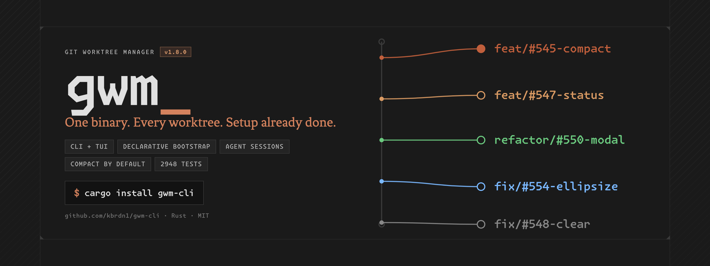
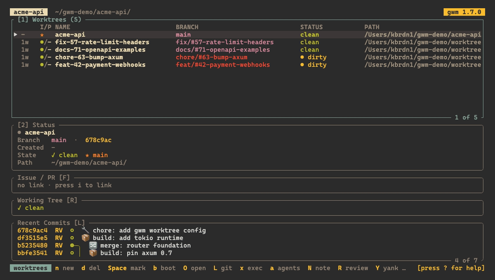

<p align="center">
  <a href="https://gwm.kbrdn.dev/">
    <picture>
      <source media="(prefers-color-scheme: dark)" srcset="docs/_assets/promo.png">
      <source media="(prefers-color-scheme: light)" srcset="docs/_assets/promo-light.png">
      
    </picture>
  </a>
</p>

# <picture><source media="(prefers-color-scheme: dark)" srcset="docs/_assets/logo.svg"><source media="(prefers-color-scheme: light)" srcset="docs/_assets/logo-light.svg"></picture> gwm: git worktree manager

[](https://github.com/kbrdn1/gwm-cli/actions/workflows/ci.yml)
[](https://github.com/kbrdn1/gwm-cli/releases)
[](LICENSE.md)
[](https://www.rust-lang.org/)
[](https://gwm.kbrdn.dev/)

**One binary to manage every git worktree in every repo, with the setup already done.**

`gwm create feat 42 user-auth` branches it, places it on disk, copies the files you told it to, runs the setup commands you configured, and links GitHub issue #42. Then bare `gwm` opens a TUI over all of them.


Written in Rust on vendored `libgit2`, so worktree operations are native rather than shelled out, and there is no `gwq` to install. `git` itself is still required on `PATH` for the operations that call it. Installs from Cargo, Homebrew, Scoop, Nix, aqua, the AUR, `.deb` and `.rpm`.

**What you get that a `git worktree add` wrapper doesn't:**

- **Bootstrap that actually runs your project.** File copies with deny-list regexes (born from a real "AWS RDS credentials in a copied `.env`" incident), six lifecycle hook phases, stack presets for Laravel / Symfony / Node / Rust / Go / Python.
- **A TUI you can live in.** Embedded lazygit and shell overlays, a details sidebar with CI state and working-tree file explorer, remappable keys, themes, command palette. Compact by default since 1.8.0: sections are delimited by a filled header line rather than a box rule, which buys back two rows and two columns each. `[tui] layout = "bordered"` restores the lazygit-style frames.
- **It knows which AI agent works where.** Sessions from Claude Code, Codex, opencode and Mistral Vibe are detected from their on-disk artefacts (no process enumeration, Windows included; on Unix a dead recorded PID drops the session to idle at once) and surfaced everywhere: an AGENT column in the table and TUI, a detail overlay on `a`, `gwm agents` with manual pinning, the JSON/daemon field and the statusline (fed by the daemon transport everywhere: a unix socket, or a named pipe on Windows).
- **A machine surface, not just a human one.** `--format=json`, a JSON-RPC daemon with a push stream, and `gwm statusline` for your prompt. The schemas are frozen under SemVer.
- **Undo.** `gwm undo` and `gwm history` recover a worktree you removed by mistake, without `git reflog`.

> **Full documentation lives in [`docs/`](docs/).** This README is the landing page; every feature has a dedicated section in the doc tree.

## install

| Channel          | Command                                                              |
|:-----------------|:---------------------------------------------------------------------|
| Cargo (crates.io) | `cargo install gwm-cli`                                             |
| Cargo (source)   | `cargo install --path .`                                             |
| cargo-binstall   | `cargo binstall gwm-cli`                                             |
| Homebrew (macOS) | `brew tap kbrdn1/tap && brew install gwm`                            |
| Scoop (Windows)  | `scoop bucket add gwm https://github.com/kbrdn1/scoop-gwm; scoop install gwm` |
| Nix flake        | `nix profile install github:kbrdn1/gwm-cli`                          |
| aqua             | `aqua g -i kbrdn1/gwm-cli`                                           |
| Debian / Ubuntu  | `.deb` from [Releases](https://github.com/kbrdn1/gwm-cli/releases) → `sudo apt install ./gwm-cli_<ver>-1_amd64.deb` |
| Fedora / RHEL    | `.rpm` from [Releases](https://github.com/kbrdn1/gwm-cli/releases) → `sudo dnf install ./gwm-cli-<ver>-1.x86_64.rpm` |
| Arch (AUR)       | `yay -S gwm-cli-bin` (or `paru -S gwm-cli-bin`): community-maintained ([#430](https://github.com/kbrdn1/gwm-cli/issues/430)) |
| Prebuilt         | <https://github.com/kbrdn1/gwm-cli/releases> (Linux / macOS / Windows) |

**On the AUR row:** `gwm-cli-bin` is packaged and maintained by a community contributor, not by this project, so its version can lag behind a release. It has tracked recent releases closely, but the guarantee is not ours to give. Every other channel in the table is published from this repository's release pipeline. See [#430](https://github.com/kbrdn1/gwm-cli/issues/430); if it ever trails a release you need, `cargo binstall gwm-cli` or a prebuilt tarball gets you the current version on Arch in the meantime.

The crate is published as **`gwm-cli`** (the bare `gwm` name on crates.io belongs to an unrelated project): the installed command is still `gwm`. `cargo binstall gwm-cli` grabs the prebuilt binary from the matching GitHub Release instead of compiling `git2`/vendored-libgit2 from source, so no Rust toolchain needed at install time.

Full install matrix and verification steps: [`docs/getting-started/install.md`](docs/1.getting-started/1.install.md).

## the 30-second tour



```bash
cd /path/to/your/repo
gwm init                                          # write a default .gwm.toml
gwm init --preset laravel                          # …or seed a stack preset (laravel/symfony/node/rust/go/python-uv)
gwm init --list-presets                            # list the built-in presets
gwm create feat 42 user-authentication            # → ~/cc-worktree/<repo>/feat-42-user-authentication
                                                  # → branch feat/#42-user-authentication
gwm                                               # opens the TUI on the current repo
gcd auth                                          # fuzzy-jump into the worktree (needs `gwm shell-init`)
```

Step-by-step walkthrough: [`docs/getting-started/first-worktree.md`](docs/1.getting-started/2.first-worktree.md).

## what gwm does

- **Native worktree ops** via vendored `libgit2`: `git worktree add/list/remove/prune` without shelling out.
- **CLI + ratatui TUI**: `gwm <subcommand>` for scripts, bare `gwm` opens the interactive interface.
- **JSON API + daemon** ([#38](https://github.com/kbrdn1/gwm-cli/issues/38)): `--format=json` on `gwm list` / `doctor` / `path` (stable schemas under [`docs/schema/`](docs/schema/)), and `gwm daemon`, a JSON-RPC 2.0 server over a unix socket (`list` / `doctor` / `path` + a `subscribe` push stream) so editors and statusbars connect once instead of shelling out per query.
- **First daemon consumer, `gwm statusline`** ([#309](https://github.com/kbrdn1/gwm-cli/issues/309)): a thin, dependency-free client that renders a compact one-line worktree summary (active branch · count · dirty/ahead/behind · issue/PR) for tmux / starship / zsh prompts off the daemon; `--watch` rides the `subscribe` stream, and with no daemon it degrades to a blank line. See [Integrations → Daemon consumers](docs/5.integrations/4.daemon-consumers.md).
- **Multi-repo workspace mode** ([#36](https://github.com/kbrdn1/gwm-cli/issues/36)): `gwm --workspace ~/Projects` opens the TUI across every git repo one level below a root (a REPO column tags each row; the active repo follows the selection); `gwm list --workspace ~/Projects` prints the merged table; `gwm create --repo <name>` picks the target. Bare `gwm` in a repo-free dir that holds child repos offers to open it as a workspace.
- **Per-repo `.gwm.toml` + user-level global config**: branch / path conventions, file copies, regex guards, no-symlink invariants. A `~/.config/gwm/config.toml` deep-merges underneath each repo's `.gwm.toml`. Edit it git-config-style with `gwm config get / set / list / validate`.
- **Config presets for `gwm init`** ([#37](https://github.com/kbrdn1/gwm-cli/issues/37)): `gwm init --preset <name>` seeds an opinionated `.gwm.toml` for a known stack (`laravel` / `symfony` / `node` / `nuxt` / `rust` / `go` / `python-uv` / `generic`) instead of the generic template; `--list-presets` enumerates them, `--show` prints the resolved TOML without writing.
- **Lifecycle hooks `[hooks.*]`**: `pre_create` / `post_create` / `pre_bootstrap` / `post_bootstrap` / `pre_remove` / `post_remove` phases, each with `when:` predicates and per-step `on_fail = abort|warn|ignore`.
- **CLI aliases + Gitmoji convention**: `[aliases]` expand `gwm <alias>` to argv before parsing; `gwm commit-prefix`, `gwm types --gitmoji`, and an opt-in `gwm hooks install commit-msg` hook enforce the repo's Gitmoji + Conventional Commits style.
- **GitHub workflow**: branches matching `<type>/#<N>-<slug>` auto-link to their issue (with ephemeral PR auto-detection); `gwm new` opens an issue from a template then spins up the worktree, `gwm pr` renders the PR body; `gwm review <PR#>` ([#308](https://github.com/kbrdn1/gwm-cli/issues/308)) pulls an existing PR (including one from a fork) into an isolated worktree (fetch + link), the inbound counterpart to `gwm create` (safe-by-default: bootstrap/hooks are opt-in via `--bootstrap`, since a fork PR's setup commands are arbitrary code); live status surfaces in the TUI sidebar via `gh`.
- **Safety daily**: `--dry-run` on `gwm remove` / `gwm prune` to preview, `gwm undo` + `gwm history` to recover a misfired removal, a confirm-overlay countdown on armed branch-deletion, and deny-list regexes on copied files (the original "no AWS RDS in `.env`" incident, generalised).
- **Bulk cleanup** ([#484](https://github.com/kbrdn1/gwm-cli/issues/484)): `Space` marks rows in the TUI and `d` deletes the batch behind one confirm (`D` arms the branch deletion for all of them); `gwm remove a b c` is the non-interactive form, resolving every pattern before it touches anything so a typo removes nothing.
- **Per-worktree notes** ([#515](https://github.com/kbrdn1/gwm-cli/issues/515)): `N` opens the selected worktree's note in an editable modal (`Ctrl+e` hands it to `$EDITOR`) and the table marks the rows that carry one. Plain Markdown under `<main-checkout>/.git/gwm/notes/`, so it is greppable with gwm shut down, never committed, and it survives `gwm remove`; `gwm note show [slug]` reads it back and the `--format=json` rows carry it. `gwm doctor` reports a note whose branch is gone.
- **`gwm sync`**: fetch a worktree's upstream and rebase (or `--merge`) its branch onto it, conflict-safe.
- **Fleet chores across worktrees** ([#313](https://github.com/kbrdn1/gwm-cli/issues/313)): `gwm exec [<slug>...] -- <cmd>` runs a command in each worktree sequentially (everything after `--` forwarded verbatim) and prints a `✓ / ✗` rollup, exiting non-zero if any failed; `gwm clean [<slug>...]` reports reclaimable build artifacts (`target/`, `node_modules/`, `dist/`, `build/`) per worktree, deleting them only with `--yes`. A saved profile can carry a [`[container]`](docs/4.configuration/1.gwm-toml.md) block ([#421](https://github.com/kbrdn1/gwm-cli/issues/421)) to run its command in `docker run` / `podman run`, mounting the worktree *and* the main checkout's gitdir at their host paths so git still answers inside the container.
- **Configurable launchers**: drive the TUI's `l` (git TUI) and `r` / `R` (review) keybindings through `[git_tui]` and `[review]` sections in `.gwm.toml`.
- **TUI personalisation**: role-based `[theme]` presets (`catppuccin` / `gruvbox` / `tokyo-night` / `claude-dark`), a remappable `[tui.keys]` keymap with multi-key chords (plus rebindable per-context modal keys under `[tui.keys.modal.<context>]`, all editable live from the Settings panel's Keys tab), a `:` command palette, a sidebar stashes mode, and a persisted sidebar layout (`[tui] sidebar_orientation`, one of `auto` / `side-by-side` / `stacked`, [#365](https://github.com/kbrdn1/gwm-cli/issues/365)), all responsive down to a narrow terminal.
- **Embedded PTY overlays** ([#35](https://github.com/kbrdn1/gwm-cli/issues/35)): `l` / `L` open lazygit and `o` / `O` open a native `$SHELL` session inside the TUI (no alternate-screen swap); `Esc` closes the overlay.
- **Works over SSH** ([#367](https://github.com/kbrdn1/gwm-cli/issues/367)): the yank actions (path / branch / worktree name / command logs) route through an OSC52 escape sequence when an SSH session is detected, so the text lands in *your* clipboard rather than the remote host's. `[tui] clipboard = "auto"` (the default) picks per session; `osc52` / `tools` force either path. Wrapped in DCS passthrough under tmux (needs `allow-passthrough on`); falls back to the host tools inside GNU screen.
- **Richer Status sidebar**: the Working Tree pane renders `git status` as a nerd-font file-explorer tree ([#300](https://github.com/kbrdn1/gwm-cli/issues/300)) with git-coloured rows, and the Issue/PR section surfaces the linked PR's overall CI state (` CI passing 9/9` / ` CI failing 7/9` / ` CI running 8/9`) derived from the already-fetched rollup ([#299](https://github.com/kbrdn1/gwm-cli/issues/299)).
- **TOFU trust ledger on `.gwm.toml`** ([#95](https://github.com/kbrdn1/gwm-cli/issues/95)): first `gwm create` / `gwm bootstrap` against a repo prints the bootstrap surface (copies, guards, commands) and prompts before running anything. Recorded in `~/.config/gwm/trust.toml` keyed on `(origin URL, sha256 of .gwm.toml)`; any byte change re-prompts. CI bypass: `--allow-bootstrap` or `GWM_ALLOW_BOOTSTRAP=1`. Manage with `gwm trust add / list / revoke / show`. `add` approves the current repo without running anything, which is how you answer the same gate on a [self-hosted forge host](docs/5.integrations/5.gitlab.md#authorising-a-self-hosted-host), where there is no prompt to answer because the check also runs on the TUI's selection path.

## documentation

Published at **<https://gwm.kbrdn.dev>**, and it keeps itself there: a delivery landing on `main` that touches `docs/` fires a resync and a redeploy on its own ([#423](https://github.com/kbrdn1/gwm-cli/issues/423)).

The full tree lives under [`docs/`](docs/): 39 pages in English, every one of them translated in French under [`docs/fr/`](docs/fr/). Numeric prefixes drive the sidebar order and every page carries frontmatter, so the tree renders as-is into the static site. The in-repo tree is the source of truth: the site is generated from it, never edited on the other side.

| Section                                                         | Read this when …                                                              |
|:----------------------------------------------------------------|:------------------------------------------------------------------------------|
| [Getting Started](docs/1.getting-started/index.md)              | you want to install gwm and create your first worktree                        |
| [TUI](docs/2.tui/index.md)                                      | you live in the ratatui interface: keymap, sidebar, launchers, filter        |
| [CLI](docs/3.cli/index.md)                                      | you script gwm from shells, CI jobs, or `gh` aliases                          |
| [Configuration](docs/4.configuration/index.md)                  | you're writing or extending `.gwm.toml`: bootstrap, guards, predicates       |
| [Integrations](docs/5.integrations/index.md)                    | you wire gwm with `gh`, `lazygit`, AI reviewers, Homebrew, Nix, or `gwm doctor` in CI |
| [Development](docs/6.development/index.md)                      | you're contributing: test layout, conventions, dev shell                     |
| [Roadmap](docs/7.roadmap.md)                                    | you want to know what shipped and what comes next                             |
| [Comparison](docs/8.comparison.md)                              | you're weighing gwm against lazyworktree or gwq                               |

The [`docs/README.md`](docs/README.md) page documents the authoring conventions (frontmatter contract, numeric-prefix routing, link semantics) for anyone editing the tree.

## history

gwm started as a Rust rewrite of `tools/worktree-manager.sh`, a bash script tied to one team's Laravel stack and one repo's incident history. The Rust version keeps the lessons, makes them configurable per repo, and ships as a single binary so it works in every repo without per-project shell-script copies. Full background under [Development → Contributing → history](docs/6.development/2.contributing.md#history).

## sponsor

gwm is MIT and built on personal time. If it saves you some of yours, you can support it through [GitHub Sponsors](https://github.com/sponsors/kbrdn1).

Sponsoring buys nothing in particular: no priority support, no roadmap influence, no private builds. It pays for the time that goes into the release pipeline, the docs tree and the issue queue. Reporting a bug, sending a PR or packaging gwm for a channel it does not reach yet helps just as much.

## license

MIT, see [LICENSE.md](LICENSE.md).

## related docs

- [`CHANGELOG.md`](CHANGELOG.md): release index (root = `[Unreleased]`; per-version archives under [`changelogs/`](changelogs/))
- [`CONTRIBUTING.md`](CONTRIBUTING.md): branch / commit / PR conventions
- [Stability & compatibility](docs/6.development/3.stability.md): the 1.0 SemVer contract: what's covered, what's free to change, MSRV, deprecations
- [`ROADMAP.md`](ROADMAP.md): long-form roadmap with grouped categories
- [`CODE_OF_CONDUCT.md`](CODE_OF_CONDUCT.md)
- [`.github/LABELS.md`](.github/LABELS.md)
- [`examples/gwm.toml.example`](examples/gwm.toml.example): annotated full config
- [`skills/SKILL.md`](skills/SKILL.md): the bundled Claude Code skill manifest
